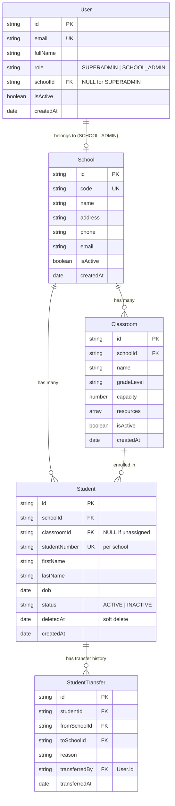

# School Management System API (Axion Template)

This project implements a School Management System API on top of the Axion template with:

- JWT authentication (long token + short token)
- RBAC (`SUPERADMIN`, `SCHOOL_ADMIN`)
- School-scoped authorization for admin operations
- Entities: School, Classroom, Student
- Transfer workflow: Student -> Classroom transfer
- Automated endpoint tests

## Tech Stack

- Node.js + Express
- MongoDB (primary persistence)
- Redis (template runtime services)
- Mongoose

## Run Locally

1. Start MongoDB:
   - `sudo systemctl start mongod`
2. Start Redis (if not already running).
3. Install dependencies:
   - `npm install`
4. Create env file:
   - `cp .env.example .env`
5. Start API:
   - `node index.js`

Default local API URL: `http://127.0.0.1:5112`
Health check: `GET /health`
Swagger UI: `GET /docs`
OpenAPI JSON: `GET /docs.json`

## Admin Dashboard (Next.js)

A role-aware admin dashboard is included in `admin-dashboard/`.

Run locally:

1. Install dashboard dependencies:
   - `cd admin-dashboard && npm install`
2. Create dashboard env file:
   - `cp .env.example .env.local`
3. Start dashboard:
   - `npm run dev`

Dashboard URL: `http://127.0.0.1:3000`

Shortcut commands from repository root:

- `npm run dashboard:dev`
- `npm run dashboard:build`
- `npm run dashboard:start`

## Environment Variables

Required:

- `LONG_TOKEN_SECRET`
- `SHORT_TOKEN_SECRET`
- `NACL_SECRET`

Core runtime:

- `MONGO_URI` (default local)
- `USER_PORT`
- `REDIS_URI` / `CORTEX_REDIS` / `OYSTER_REDIS` / `CACHE_REDIS`

Security controls (optional overrides):

- `RATE_LIMIT_WINDOW_MS` (default: `900000`)
- `RATE_LIMIT_MAX` (default: `300`)
- `API_MAX_BODY_SIZE` (default: `100kb`)
- `CORS_ORIGIN` (default: `*`)

## API Endpoints (v1)

All requests use `POST /api/:module/:fnName`.

### Auth

- `POST /api/user/v1_register`
- `POST /api/user/v1_login`
- `POST /api/token/v1_createShortToken`

### School (SUPERADMIN)

- `POST /api/school/v1_createSchool`
- `POST /api/school/v1_getSchool`
- `POST /api/school/v1_listSchools`
- `POST /api/school/v1_updateSchool`
- `POST /api/school/v1_deleteSchool` (blocked if linked admins/classrooms/students exist)

### Classroom (SCHOOL_ADMIN + school scope)

- `POST /api/classroom/v1_createClassroom`
- `POST /api/classroom/v1_getClassroom`
- `POST /api/classroom/v1_listClassrooms`
- `POST /api/classroom/v1_updateClassroom`
- `POST /api/classroom/v1_deleteClassroom`

### Student (SCHOOL_ADMIN + school scope)

- `POST /api/student/v1_createStudent`
- `POST /api/student/v1_getStudent`
- `POST /api/student/v1_listStudents`
- `POST /api/student/v1_updateStudent`
- `POST /api/student/v1_deleteStudent`
- `POST /api/student/v1_transferStudent`

## Authentication Flow

1. Bootstrap the first superadmin with `v1_register` (`role=SUPERADMIN`).
2. Additional `SUPERADMIN` creation requires a valid superadmin long token in `token` header.
3. Login to obtain a long token.
4. Send long token in `token` header for protected routes.
5. Optionally create short token via `v1_createShortToken`.

## Error Handling Contract

Standard response shape:

- `ok`: boolean
- `data`: object/array
- `errors`: array/string
- `message`: string

Typical status mapping:

- `200`: success
- `400`: validation or business error
- `401`: unauthorized
- `403`: forbidden (RBAC/scope)
- `500`: internal server error

## Security

Implemented baseline hardening:

- `helmet` secure HTTP headers
- API rate limiting (`express-rate-limit`)
- Request body size limit for JSON/urlencoded payloads
- Configurable CORS origin

## Database Schema Diagram



## Postman

Import:

- `postman/axion-auth-v1.postman_collection.json`

Collection includes auth, school, classroom, and student flows with variable captures.

## Swagger / OpenAPI

- Interactive docs: `http://127.0.0.1:5112/docs`
- Raw spec: `http://127.0.0.1:5112/docs.json`
- Spec file path: `docs/openapi.json`

## Automated Tests

Start the API first (default `http://127.0.0.1:5112`), then run:

```bash
npm test              # run all tests
npm run test:fresh    # clean DB + run all tests
npm run test:cleanup  # wipe test data from MongoDB
```

### Test Results (31 / 31 passing)

```
✔ v1_register creates a SUPERADMIN user (289ms)
✔ v1_login returns longToken for registered user (83ms)
✔ v1_createShortToken returns shortToken from a valid longToken (44ms)
✔ v1_register returns clear validation error for invalid role (3ms)
✔ v1_login returns invalid credentials for wrong password (78ms)
✔ protected endpoint returns 401 without token (2ms)
✔ protected endpoint returns 401 with invalid token (5ms)
✔ v1_register blocks additional SUPERADMIN creation without token (83ms)
✔ v1_register allows additional SUPERADMIN creation with SUPERADMIN token (159ms)
✔ v1_register rejects SCHOOL_ADMIN with unknown schoolId (81ms)
✔ v1_register allows SCHOOL_ADMIN with valid schoolId (157ms)
✔ classroom v1 CRUD works for SCHOOL_ADMIN (312ms)
✔ classroom create fails validation for missing required fields (222ms)
✔ classroom create rejects duplicate name within same school (234ms)
✔ classroom get/update/delete return not found for unknown id (229ms)
✔ classroom CRUD works for SUPERADMIN (full system access) (78ms)
✔ classroom school scope denies SCHOOL_ADMIN for other school (229ms)
✔ school v1 CRUD endpoints work for SUPERADMIN (150ms)
✔ school create returns validation errors for bad payload (77ms)
✔ school RBAC denies SCHOOL_ADMIN for school endpoints (319ms)
✔ school get/update/delete return not found for unknown id (93ms)
✔ school delete is blocked when linked entities exist (241ms)
✔ student v1 CRUD and transfer work for SCHOOL_ADMIN (324ms)
✔ student create fails validation for missing required fields (287ms)
✔ student create rejects invalid dob format (307ms)
✔ student create rejects duplicate studentNumber in same school (278ms)
✔ student get/update/delete return not found for unknown id (257ms)
✔ student CRUD works for SUPERADMIN (full system access) (97ms)
✔ student school scope denies SCHOOL_ADMIN for other school (247ms)
✔ student transfer fails when student is not found (248ms)
✔ student transfer fails when target classroom is outside school (410ms)
ℹ tests 31 | pass 31 | fail 0 | duration ~5.8s
```

### Coverage by Suite

| Suite | Tests | Covers |
|-------|-------|--------|
| `auth.v1.test.js` | 11 | Registration, login, token creation, RBAC guards, invalid credentials |
| `classroom.v1.test.js` | 6 | CRUD, validation, duplicates, SUPERADMIN access, school scope |
| `school.v1.test.js` | 5 | CRUD, validation, RBAC, not-found, delete guards |
| `student.v1.test.js` | 9 | CRUD, validation, DOB format, duplicates, SUPERADMIN access, scope, transfer |

### Test Utilities

- `tests/_helpers/apiTestUtils.js` — shared HTTP helpers, auth bootstrap, school/admin creation
- `tests/_helpers/cleanup.js` — MongoDB test data cleanup script

## Deployment Instructions

Recommended quick path (Render/Railway/Fly):

1. Push code to a public Git repository.
2. Create a new Node.js web service from the repo.
3. Set start command: `node index.js`
4. Add all required environment variables.
5. Provision MongoDB + Redis services (or use managed providers).
6. Update `MONGO_URI` and Redis URLs in environment.
7. Deploy and verify with Postman collection.

## Submission Checklist

- Public repository URL
- Public deployed API URL
- README with setup, env vars, endpoints, auth flow
- Postman collection
- Test results (`npm test` passing)
- Assumptions/notes section (if any deviations)

## Assumptions

- The Axion template routing style (`POST /api/:module/:fnName`) is preserved by design.
- "Transfer" is implemented as student transfer between classrooms inside a school scope.
- School administrators are strictly limited to their assigned `schoolId`.
